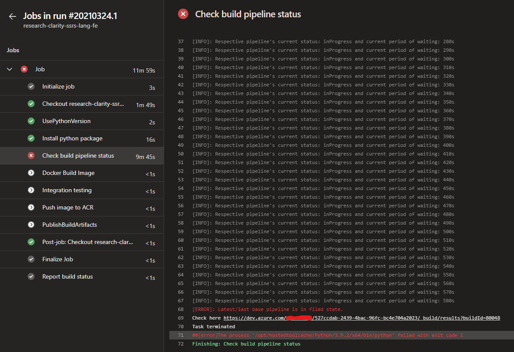

??? success inline "Date"
    17^t^^h^ April, 2021
??? success inline end "Author"
    Akash Desarda

<br>
<br>
<br>
## 1. The Problem

!!! note ""
    I believe to better understand any blog, understanding its original requirement is essential.

We use serval microservices in our application which is finally deployment using kubernetes. Each microservices has two CI pipeline:

1. **Base pipeline**: Used to install all dependencies.
2. **Build pipeline**: Used to build service on top of *base pipeline*.

Now, the frequency to run *base pipeline* as compared to *build pipeline* is rare as dependencies changes very rarely. Both *base pipeline* and *build pipeline* produces docker images as end result which is finally push to our container registry. If pipelines fails then its respective docker image is not pushed.

Initially, I used to manually check them every time. Its not that daunting as it sounds as there were few checks in place,

1. Docker image in *build pipeline* is build on top docker image from *base pipeline*. So even if latest *base pipeline* fails, *build pipeline* will simply pulled an earlier successfully pushed image.

2. In some rare scenario where if both the pipeline is triggered at the same time then I have to manually pause the *build pipeline* till *base pipeline* is not succeeded. Now this is **defeating the purpose of automation via CI pipeline** 😭

As I mentioned earlier, *base pipeline* can pull docker image from repository no matter what is the status of *base pipeline*. This is done intentionally so that the CI pipeline will not break. But this also gave rise harmful design flaw. Ideally *build pipeline* must have all the latest packages and utilities installed. Smart people can definitely smell a trade-off here.

*So lets summarize into an checklist which can solve all this problems, ideally he **build pipeline** should check following checklist before staring its xecution:*

- [X] Is the *base pipeline* running?  
  - If running then wait and check after some interval using pooling mechanism
  - Resume as soon as *base pipeline* succeeds
- [X] What is status of latest completed *base pipeline*?
  - If it is succeeded then continue
  - If it is failed then stop *build pipeline*

---

## 2. The Solution

After going through the problem now its time to go through the solution.

### 2.1 Personal Access Token (PAT)

We'll need PAT to establish connection with Azure DevOps and create its client. Follow this [official guide](https://docs.microsoft.com/en-us/azure/devops/organizations/accounts/use-personal-access-tokens-to-authenticate?view=azure-devops&tabs=preview-page "Create a PAT") from Microsoft to create one. Make sure the PAT must have **Read access** for **Build** and **Release**. You can enable it from **Edit > Scopes**.

!!! warning
    Make sure not to loose the PAT token key. As it is not stored anywhere an Azure devops and can be only copied once at the time of creation.

### 2.2 Creating Azure devops client

Azure DevOps provide extensive support through its [REST api](https://docs.microsoft.com/en-us/rest/api/azure/devops/?view=azure-devops-rest-6.1 "Azure DevOps REST api") 🚀. We can directly use REST api over HTTPS operation, but we can't build custom logic around it. So instead I am using [Azure DevOps Python API](https://github.com/microsoft/azure-devops-python-api)

Lets see how to create the client

```python
from azure.devops.connection import Connection
from msrest.authentication import BasicAuthentication

# Setting up client to connect Azure devops 
credentials = BasicAuthentication("", 'YOURPAT')
connection = Connection(base_url="<https://dev.azure.com/YOURORG>", creds=credentials)
core_client = connection.clients.get_core_client()
build_client = connection.clients.get_build_client()
```

### 2.3 Retrieve Builds

Here I will retrieve specific builds of in focus *base pipeline* with the help of filters. The best part of this REST api is that they are updated instantly 😍.

```python
 builds = build_client.get_builds(
        project="<Your project name>",
        repository_id=<Your repo id>,
        repository_type="TfsGit", # For git based repo
        branch_name="refs/heads/develop", # IF you want to retrieve build run for specif branch. In my case it is develop. ⚠ Do not remove 'refs/heads/'
        definitions=[<Your pipeline's definitionId>],
    )
```

!!! tip
    I struggled a bit for searching 'definitionId'. But there's a neat trick, just goto your pipeline's build page (where it shows all history of runs) and in the url you will find it.

### 2.4 Pooling Mechanism

This is the most critical part as it will ensure to tick all element from the above checklist. The script first checks result of last build and if its not in failed state then continue to check status for completion. This step is repeated for every 10 seconds with timeout of 30m

```python
for step_time in list(range(10, 1810, 10)):

    builds = build_client.get_builds(
        project="<Your project name>",
        repository_id=<Your repo id>,
        repository_type="TfsGit",
        branch_name="refs/heads/develop",
        definitions=[<Your pipeline definitionId>],
    )

    # Time out with 30m
    if step_time == 1800:
        logger.error(
            f"Time out as build pipeline is talking more than 30m.\nCheck the pipeline to investigate here {builds.value[0].url.replace('_apis/build/Builds/', '_build/results?buildId=')}"
        )
        os.sys.exit("Task terminated")

    # Checking last result
    if builds.value[0].result == "failed":
        logger.error(
            f"Latest/last base pipeline is in filed state.\nCheck here {builds.value[0].url.replace('_apis/build/Builds/', '_build/results?buildId=')}"
        )
        os.sys.exit("Task terminated")

    # Checking for current status 
    if builds.value[0].status == "completed":
        logger.info("Since base pipeline is ready moving ahead")
        break
    else:
        logger.info(
            f"Respective pipeline's current status: {builds.value[0].status} and current period of waiting: {step_time}s"
        )
        time.sleep(10)
```

!!! info
    I had even added a little extra logging information in case of failure to point out to failed run.
    ```python
    logger.error(
            f"Latest/last base pipeline is in filed state.\nCheck here {builds.value[0].url.replace('_apis/build/Builds/', '_build/results?buildId=')}"
        )
    ```
    and 
    ```python
    logger.info(
            f"Respective pipeline's current status: {builds.value[0].status} and current period of waiting: {step_time}s"
        )
    ```

---

### 3. Integration with Pipeline

This part can vary with your use-case or preference. This is how I do it.

1. I put the script at fix location in every repo
2. I set python version to be used as 3.x
3. I used pipeline variable to pass some parameters to the script. Like PAT which I store it as secret and then pass it the script. 
4. Then finally I used *Run Python Script* task of Azure DevOps pipeline to run it.

```yaml
- task: UsePythonVersion@0
  inputs:
    versionSpec: '3.x'
    addToPath: true
    architecture: 'x64'

- task: CmdLine@2
  displayName: Install python package
  inputs:
    script: 'python3 -m pip install requests azure-devops'

- task: PythonScript@0
  displayName: Check build pipeline status
  inputs:
    scriptSource: 'filePath'
    scriptPath: '$(System.DefaultWorkingDirectory)/tests/base_pipeline_status.py'
    arguments: '--personal_access_token $(PERSONALACCESSTOKEN) --repo_id e589ca4a-16ff-453b-b101-2a9f21542d76 --pipeline_def_id 183' # You can see I am passing PAT token to PERSONALACCESSTOKEN from pipeline variable
```

!!! tip
    I always run this task at beginning as to avoid running other task unnecessarily if this fails eventually.

Here is a screenshot of working of the logic



**Tags:**
[Azure Devops](../tags.md## <span class="tag">Azure DevOps</span>),  [CI/CD](../tags.md## <span class="tag">CI/CD</span>)
